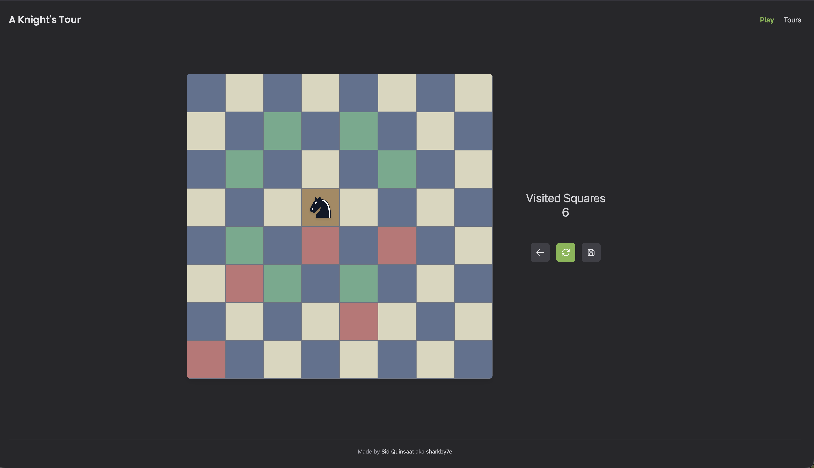

# Knight's Tour

**[Play it live →](https://sidquinsaat.com)**

A Rails app for playing the [Knight's Tour](https://en.wikipedia.org/wiki/Knight%27s_tour) puzzle: move a knight around a chessboard, visiting every square exactly once. Finish, get stuck, or just wander — every attempt can be saved and shows up in the [community gallery](https://sidquinsaat.com/tours).



## Why this exists

This started as a rebuild of an older, messier version of the same app, and turned into a place to practice deliberate engineering:

- **Play is entirely client-side.** Move legality, undo, and restart all run in JS with zero network round-trips per move. An earlier version routed every move through the server via a Turbo Frame — even with that in place, per-move latency (~250–400ms) never felt snappy, so the game logic moved to the browser instead.
- **Server validation stays minimal on purpose.** Saving a tour re-checks each move is a legal knight's-move from the one before it, rather than reintroducing a full board-legality engine server-side. The client owns the play experience; the server just keeps the saved data honest.
- **Built one small, verified step at a time.** Each feature branch is planned in [`docs/PLAN.md`](docs/PLAN.md) — checked into git, not a scratch doc — and built red → green → commit per step, so work is resumable from the plan and `git log` alone even across sessions.
- **Architecture changed when the tradeoffs did.** The game logic went through three real rewrites (Turbo Streams → a single Turbo Frame → fully client-side) — `docs/PLAN.md`'s history section documents why each one got replaced.

## Local development

Install the Ruby version pinned in `.tool-versions` with whatever version manager you use (I use [mise](https://mise.jdx.dev/): `mise install`). Docker is only needed later, for building/deploying the production image.

```bash
bundle install
bin/rails db:prepare  # creates and migrates the database
bin/dev               # starts Rails + the Tailwind watcher (Procfile.dev)
```

Visit `http://localhost:3000`.

### Tests

```bash
bundle exec rspec
```

### Linting

RuboCop runs in CI, and there's a `pre-push` hook that runs it locally too. Enable it once per clone:

```bash
git config core.hooksPath .githooks
```

## Running the production image locally

Day-to-day development doesn't need Docker (see above) — this is for testing the actual image that gets deployed, e.g. after Dockerfile or database changes.

```bash
docker build -t knights_tour .

docker network create knights_tour_net
docker run -d --name knights_tour_postgres --network knights_tour_net \
  -e POSTGRES_USER=knights_tour -e POSTGRES_PASSWORD=<pick-a-local-password> \
  -e POSTGRES_DB=knights_tour_production \
  postgres:17

docker run -d --name knights_tour_app --network knights_tour_net -p 3000:80 \
  -e RAILS_MASTER_KEY=$(cat config/master.key) \
  -e DB_HOST=knights_tour_postgres -e DB_PORT=5432 \
  -e POSTGRES_USER=knights_tour -e POSTGRES_PASSWORD=<pick-a-local-password> \
  knights_tour
```

Visit `http://localhost:3000` (note: host port 3000 maps to container port 80, where Thruster listens — not 3000, which is Puma's internal-only port). `bin/docker-entrypoint` runs `db:prepare` on boot, which creates all four databases (primary/cache/queue/cable) and seeds the board automatically.

Tear down when done:

```bash
docker rm -f knights_tour_app knights_tour_postgres
docker network rm knights_tour_net
```

## Deployment

Deployed with [Kamal](https://kamal-deploy.org/) to a Hetzner Cloud VPS. See `config/deploy.yml`.

## Credits

The knight piece (`app/javascript/controllers/tour_controller.js`) and favicon derived from it are adapted from [Cburnett](https://en.wikipedia.org/wiki/User:Cburnett)'s chess piece set on [Wikimedia Commons](https://commons.wikimedia.org/wiki/Category:SVG_chess_pieces), used and modified (recolored, simplified) under [CC BY-SA 3.0](https://creativecommons.org/licenses/by-sa/3.0/).
